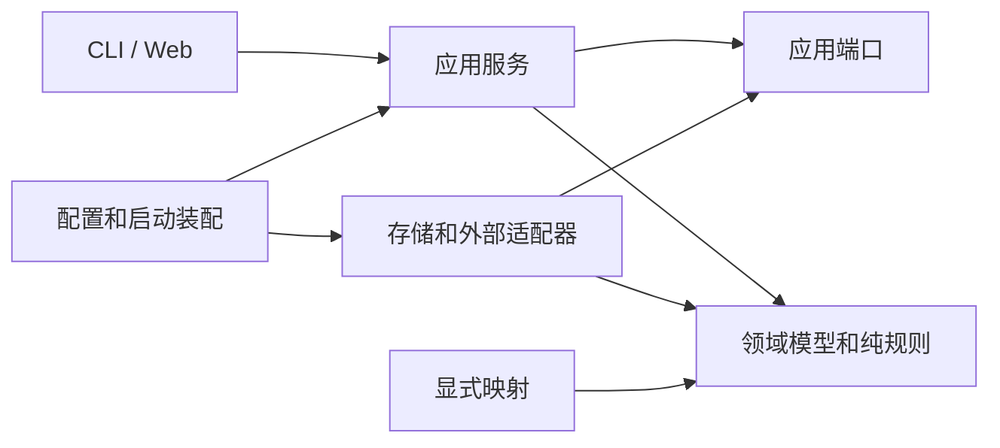

# 分包职责和依赖检查

## 当前边界

主应用入口为 `com.zoutrankil.data.QuestDataApplication`，包含 CLI 和 Web 两种模式。
批处理入口为 `com.zoutrankil.batch.BatchApplication`，使用独立启动配置。
当前仍为单 Gradle 工程；T17 将按真实共享依赖拆为 `data-core`、`data-app`、`batch-app`。

| 包/层 | 职责 | 允许的主要依赖 |
| --- | --- | --- |
| `domain` / `domain.policy` | 模型、契约、纯规则、身份和键 | JDK、序列化契约；不访问外部系统 |
| `mapper` | 来源 DTO、存储值与领域值之间的确定性转换 | domain、client DTO |
| `service` / 业务包的 application | 计划、执行、取消、恢复和业务编排 | domain、应用端口、明确的基础设施适配器 |
| 业务包的 `port` | 应用需要的目标和写入会话契约 | domain、其他端口、既有 runner/codec 的嵌套端口类型 |
| `repository` / storage | SQL、连接、事务、锁、证据文件和底层读写 | domain、应用端口；不调用具体业务编排类 |
| `client` | HTTP/外部协议及传输对象 | JDK、网络库、配置值对象 |
| `cli` / `web` | 参数/请求解析、响应和退出状态 | 应用服务及应用拥有的响应模型 |
| `config` / `bootstrap` | 装配、配置绑定、资源生命周期和启动模式 | 需要装配的组件 |



当前存量尚未全部达到这张依赖图。具体债务登记在
[`architecture-exceptions.tsv`](architecture-exceptions.tsv)，每项记录规则、调用方、被依赖类型、整改任务和原因。
登记依赖边不代表批准新增业务调用；同一依赖边内新增了多少次调用不由本检查计数。

## CLI 命令装配

`CommandLineRunner` 的生产构造器只注入 `CliCommandRegistry`，依次完成启动配置参数过滤、
`CliOptions` 词法解析和精确命令分发。旧的直接 Java 构造器由 `LegacyCliCommandFamilies` 转接；
Spring 通过命令族组件装配依赖。注册表拒绝重复和空命令名。

命令族分别负责目录、台账、调度、分组、股票、交易日历、ETF、指数、资金流、L2、派生物化和旧 QuestDB 命令。
命令族保留各自的计划、恢复和完成条件；它们与注册表都只在 CLI 模式装配。
`CliOutput` 复用私有 mapper/writer，并显式区分普通 JSON、自动时间模块、ISO 时间模块和任务契约四种格式。
compact/pretty 与时间格式分别选择，避免改变已有输出。`CliExitStatus` 继续统一映射退出码。

增加命令时，实现或扩展相应 `CliCommandFamily`，并更新命令兼容清单和参数/输出测试。
入口通过应用服务读取数据和状态，响应模型不暴露存储内部类型。

## 数据集读取注册

`ReadBindingCatalog` 明确登记 dataset ID、schemaVersion、Java 行类型、映射函数和来源版本 supplier。
`DefaultReadBindings` 当前登记 20 个类型化和 36 个通用 `DatasetValues` 表示；新数据集必须显式选择表示。
Spring 扩展可提供 `ReadBindingCatalog.Registration<?>` Bean，重复 ID 会导致装配失败。
绑定时使用当前 `DatasetRegistry` 的完整定义，以保留隔离物理表名和部署配置。
未启用的数据集可以留在目录中，已启用的 READ 数据集缺少注册或版本不符则拒绝启动。
映射函数只在读取时执行；错误返回类型或 null 保持为单个成员读取失败。

## 两套运行时共享的数据语义

`DatasetSemantics` 保存有序字段、业务键、业务日期和语义版本，集合不可变。
`DailySemantics.V1` 是 daily 的共同字段定义。主程序的 `DailyDataset`、来源字段和读回列清单引用它；
batch 在加载原 `daily.json` 后，通过 `DailySourceContractAdapter` 校验并绑定同一份字段投影。
资源中的字段顺序、类型、业务键、日期列或版本发生漂移时，加载失败。

运行时仍分别拥有物理和执行策略：主程序 YEAR 分区、batch DAY 分区，
主程序版本 `1` 与 batch `daily-v1` 显式对应；主程序使用 LocalDate，batch 归档使用 ISO 日期文本。
序列化归档版本、分页边界、覆盖判定、状态机和指纹算法不属于共同字段语义。
新增共享契约时，分别说明 source/logical/storage 名称下的键映射，并先固定两端的兼容样本。

## Batch 来源策略

`SourceContract` 保留原有 JSON 记录和调用入口；`SourceStrategies` 为每个注册数据集明确组合四类策略：

| 策略 | 职责 |
| --- | --- |
| request | 请求范围校验、分页能力、provider 路由、按代码/类别拆分请求 |
| rows | 原始行预处理、字段值转换、业务范围校验、观测日期 |
| coverage | 实体集合、市场聚合、月/季度连续覆盖 |
| storage | 业务列、技术时间、业务键、写入批量和建表 SQL |

注册表及策略可共享，未知来源没有隐式兜底。`SourceCollector` 负责通用预算、分页执行、原始证据留存、
最终排序和归档；每次 `collect` 创建独立 `SourceCollectionSession`。
ST 历史累积只保存在该 session 内，原始类别校验、证据留存、预处理、行校验与归档的先后顺序保持明确。
新增来源时补齐资源、显式策略组合、请求边界和冻结输出样本，避免在通用 collector 中增加数据集名称分支。

## ETF 业务包试点

`data.etf` 下的 application、port、storage、mapper 分别放置 basic/daily/adj/factor/portfolio/share 的业务编排、
目标契约、QuestDB 实现和显式字段映射；既有公开行模型、Key、Dataset 与来源 DTO 保持原位置。
`EtfConfiguration` 装配六个带泛型的目标，任务服务不接收 JDBC 或 QuestDB 客户端。
`EtfWriteTarget` 提供身份和 writer 工厂；basic 快照使用这一最小契约，日期型目标扩展为 `EtfTarget`。
`VerifiedWriteSession` 只提供写入和 codec 契约，ETF 日期型 session 另提供日期清单与切片读取。
portfolio 的日期指公告日期，share 的日期指交易日期。每次 `newWriter` 创建独立 session，
其中发送停止状态不能放入共享单例。Source 与 writer 的共同完整性上限由纯 Dataset 契约提供。

`SyncRunExecution` 统一台账、runner、区间锁、取消检查及 run/resume 分派；各任务仍在调用前执行原有的
计划、目标和恢复校验，并由工厂按顺序创建 writer、证据路径、source 和 adapter。
daily/adj/factor 的检查和预算处理存在已固定的差异，不能为了共用流程而合并它们。

## 股票和交易日历业务包

`data.stock` 与 `data.calendar` 各自组织 application、port、storage、mapper，覆盖八个股票目标和一个日历目标。
应用通过 target 取得身份、物理范围和独立 writer/session；存储实现拥有 JDBC、QuestDB、物理解码与 SQL。
映射和注册元数据可以共享，writer 的发送状态及每次运行的证据上下文必须独立。

Detail、ST 和 Suspend 的发布及恢复状态机仍由 application 决定，table/staging 端口只提供物理操作。
各族的正式表准入、逻辑身份、物理代际、WAL 等待、空源证明和取消方式保持独立。
Suspend 的公开目标工厂与内部 stage writer 准入分别检查，冻结的物理身份传入工厂，不能在工厂中重新规划。

ST 的硬中断恢复仅允许已完整核验的整数零行 `FETCHED` 凭证进入 `VERIFIED_EMPTY`。
恢复先核验全部阶段、每日与年度来源凭证，再核对发布后的整表、窗口及窗口外内容，完成台账后释放租约。
非空 `FETCHED`、损坏凭证或无法确定的物理布局不能触发后续重命名。

跨业务族的 group 装配仍待 T15 后续统一整理；业务包内的数据库依赖清除不能证明共享装配已经完成。

## 指数业务包

`data.index` 的 application、port、storage、mapper 与 domain 分别组织业务编排、目标契约、
物理操作、映射及纯策略。`IndexConfiguration` 装配九个目标，应用服务通过端口取得身份、
范围、table/staging 和独立写入会话；构造和计划不打开连接或创建台账。

Catalog、Membership、THS Index 和 THS Member 使用不同的快照、合并及发布证据，不能共享可变执行状态。
纯记录、字段投影、预算和合并规则可以共享；每次 staging、writer 及运行证据上下文分别创建。
THS Member 的完整空响应只允许核验已为空的板块，不能删除已有成员；正常完成和停止后恢复均需
写入 `sourceComplete`、整数零行计数及 `responseEvidence`，核验其他板块后才完成台账和释放租约。

DailyMarket、DailyBasic 和 Weight 的 session 保留各自的范围和读回契约。
Weight 通过 `StockDetailNameReadPort` 按原有预算读取名称，并在每批读取前后核对冻结身份。
Monthly 保留 READY/source 恢复、每次会话的 stage 绑定及完整读回后的发布回调；
DcIndex 保留完整窗口替换、物理代际和不同版本的发布证据，并通过 `ExchangeCalendarReadPort` 读取交易日。
各族的逻辑身份、WAL 等待、取消位置和正式表准入分别校验，不合并成通用发布协议。

DailyMarket/DailyBasic 的 group-child prior/parent 传递仍按既有行为固定；修正这一行为需要单独审阅。
跨族 group 直接构造存储组件的装配仍属于 T15 后续工作。

## 资金流和融资融券业务包

`data.flow` 和 `data.margin` 分别组织 application、port、storage、mapper 与 domain。
`FlowConfiguration`、`MarginConfiguration` 装配八个目标；应用通过目标取得逻辑/物理身份、
范围及独立写入会话，数据库客户端和 SQL 留在存储实现中。
目标、纯字段映射、codec、预算与不可变记录可以共享；每次 writer、stage 绑定、发送状态和来源证据上下文独立创建。
完整分页日历和 HSGT 有界流式 SSE 日历使用不同端口，保留原有覆盖与读取预算。

Moneyflow 正式表只允许有界 BACKFILL，不能将已有物理行推断为增量检查点。
MarginDetail 保留正式表修复窗口、发送前物理证据和原字符串行数表示。
MoneyflowDc 保留 v2 分页请求及逐页凭证；THS 的覆盖判定使用真实交易日历。
MarginZrz 保留退休日期和禁用状态，分包不自动启用任务。

HSGT、MarginAll 和 MarginZrz 的来源、stage 验证及恢复决定属于 application；
table/staging 端口只执行物理读取、建表、WAL、重命名和删除。
All/Zrz 仅在冻结运行、逻辑身份、物理代际和目标未改变均获证明后删除所属未发布 stage，再重新采集。
HSGT 完成中断发布前，先核验冻结 owner/request、run/attempt/slice 归属、唯一不可变 FETCHED、
原始凭证及完整连续窗口。仅严格整数零行的 FETCHED 可以按空源恢复；
非空或可被强制转换为零的凭证不能授权剩余重命名。
完整发布读回后才完成切片、attempt 和 run，并释放所属租约。

各任务原有取消和 parent/prior 传递方式仍分别保留；跨族 group 装配和父任务取消传播留在 T15 后续整理。

## 自动检查

```powershell
.\gradlew.bat architectureTest --console=plain
```

`check` 也包含该任务。检查使用 Java 24 ClassFile API 读取实际编译产物，包括方法体引用、数组、泛型签名、注解和 lambda；不初始化应用类。
源码补充检查显式全限定名、显式 import 以及通配 import 下的简单类型名，以识别编译器内联后消失的常量依赖，并排除普通注释和字符串。显式导入和同包类型优先于通配导入。

规则包括：

- domain 不依赖应用、存储、客户端、配置、入口、Spring 或数据库访问 API。
- mapper 不依赖应用、存储、配置或入口，也不直接访问数据库。
- repository 不依赖具体应用实现。`VerifiedBatchExecutor` 和 `SyncJobRunner` 的嵌套端口/值类型暂作为现有契约容器；直接调用外层执行器仍会报告违规。
- service/application 不持有或调用 JDBC、Spring JDBC、QuestDB 访问 API。`SQLException` 等现有异常契约暂保留。
- port 不依赖具体应用、存储、入口、Spring 或数据库 API，也不能调用 runner/codec 容器的执行方法。
- CLI/Web 不直接访问 repository、client 或数据库 API；通过泛型返回的 repository DTO 同样算依赖。
- 主应用不得反向依赖 batch。

新增违规会失败；已经消失却仍保留的例外也会失败。例外必须是精确类型名，不能使用包通配符，且必须指向 T05–T18 中明确的整改任务。检查不会自动更新例外清单。
每次运行生成 `build/reports/architecture/current-violations.tsv` 供审阅。

模块依赖和资源隔离在 T17 由 Gradle 项目依赖与发行包内容检查进一步约束；仅通过包检查不能证明两个发行包已经隔离。

## 派生族的端口与可变状态

月度 source SQL 位于 `derived.storage`，纯推导和冻结请求位于 `derived.application`；快照记录、字段投影和规范化值位于 `derived.domain`。D103 保持每个查询的原预算，D104 多次读源与前后快照保持同一绝对 deadline。Target 工厂按运行创建 writer，恢复校验使用同一 writer/session。

原生 MV 的会话保留物理源快照、目标绑定、PID 见证、refresh 与读回的实例状态；私有 attestor 通过窄接口创建，每个会话单独保存 PID 历史。日历覆盖顺序为 version-before、窗口读取与比较、version-after，不能移入通用物理 MV 写入器执行应用流程。

ETF delegated cache 的持久 claim、冻结身份和禁止重发语义由应用层拥有。进程端口负责实际进程控制，物理 target 负责有界 SELECT 读回。Session 的 attempted/unresolved/cancellation 状态不作为共享单例，三个 stopped-process 证明和释放 lease 前的最终复核保持原顺序。构造与 DI 装配不查询或启动进程；plan/preview 仍可能运行原有只读预览。
